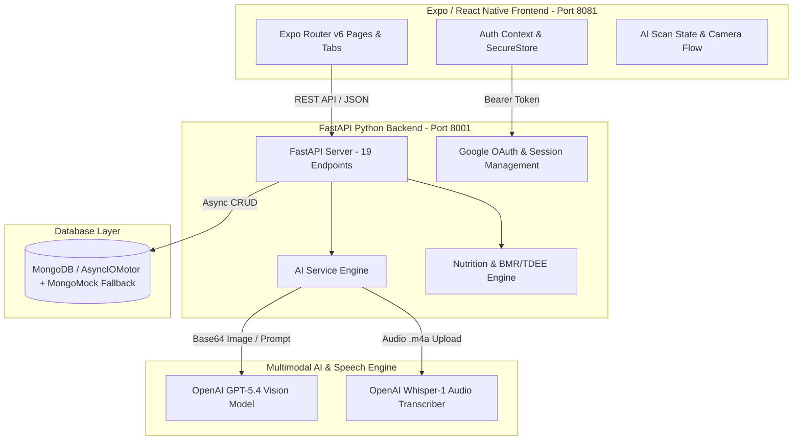

# 🥗 CalSnap — AI-Powered Nutrition Coach & Camera-First Meal Tracker
**Comprehensive Project Architecture, Feature Reference & Technical Overview**

---

## 1. Executive Summary & Vision

**CalSnap** is a state-of-the-art hybrid mobile and web application designed to bridge the gap between traditional manual calorie counting and an intelligent **AI Nutrition Coach**. 

Instead of forcing users to search endless food databases manually, CalSnap prioritizes a **Camera-First UX**: users point their camera at their meal, snap a photo (or speak a voice note), and get precise portion weights, macro breakdowns, confidence scores, and personalized dietary guidance in under 2 seconds.

### 🌟 Design & UX Aesthetics
- **Apple-Inspired Premium Clean Design:** Minimalist typography, polished rounded borders (`borderWidth: 1`), subtle shadow hierarchies, and responsive micro-interactions.
- **Harmonious Color Palette:**
  - **Warm Cream Canvas:** `#F4F1EC` (Soft, non-fatiguing background)
  - **Signature Forest Green:** `#315C28` (Primary brand accent representing organic health)
  - **Macro Accents:** Protein Green (`#315C28`), Carbs Golden Yellow (`#D99B26`), Fat Peach/Orange (`#E07A5F`)
- **Responsive Multi-Platform Target:** Built with React Native & Expo Router v6 to run seamlessly across **iOS, Android, and Desktop Web**.

---

## 2. System Architecture & Tech Stack



### 🛠️ Core Stack
| Layer | Technology | Key Libraries & Specifications |
| :--- | :--- | :--- |
| **Mobile / Web Frontend** | React Native 0.76 + Expo SDK 52 | TypeScript, React 19, Expo Router v6 (File-based Typed Routing), `expo-camera`, `expo-secure-store`, `react-native-svg` |
| **Backend API** | Python 3.10+ & FastAPI 0.110 | Asynchronous ASGI server (`uvicorn`), Pydantic v2 validation, CORS & JWT Bearer authentication |
| **AI & Vision Engine** | OpenAI Vision & Whisper | Multimodal Image Analysis (`gpt-5.4`), Audio Speech-to-Text (`whisper-1`), Structured JSON generation |
| **Database Engine** | MongoDB (Motor Async Driver) | Auto-fallback to `mongomock-motor` for zero-config local development |
| **Nutrition Logic** | Custom Scientific Calculation | Mifflin-St Jeor BMR/TDEE formula, adaptive macro splitting, hydration targets |

---

## 3. Comprehensive Feature Catalog

### ⭐ 1. AI Meal Scan (Camera-First Logging)
- **Multi-Mode AI Vision Analysis:**
  - **Standard Meal Mode:** Identifies every visible food item on the plate separately with gram weight estimates.
  - **Restaurant Mode:** Accounts for hidden cooking oils, sauces, and restaurant-style sodium density.
  - **Before/After Plate Comparison:** Analyzes pre-meal portions vs. post-meal leftovers to calculate exact consumption.
- **Confidence Scoring & Transparency:** Returns a confidence score (`0.0 - 1.0`) for every food item along with AI guidance notes (e.g., *"Visually hidden ingredients estimated"*).
- **Manual Override:** Users can adjust portion sizes or remove detected items before saving.

### 🎙️ 2. Spoken Voice Logging
- Allows hands-free logging by speaking naturally (e.g., *"I had two poached eggs, a slice of sourdough toast, and an avocado"*).
- Transcribes `.m4a` audio via **OpenAI Whisper-1** and converts the natural language transcript into structured nutrient data.

### 🏷️ 3. Barcode & Packaged Food Scanner
- Instant barcode scanning utility (`app/barcode.tsx`) for instant import of packaged goods and nutritional labels.

### 🤖 4. AI Nutrition Coach Chatbot
- Dedicated conversational coach tab (`app/(tabs)/coach.tsx`).
- Receives real-time context of the user's daily calorie progress, macro gaps, and health goals to give concise, scientific answers (<120 words).

### 📊 5. Adaptive Daily Dashboard (`Today` Tab)
- Real-time progress bar for Calorie target vs. Eaten calories.
- **Macro Matrix Cards:** Protein (`g`), Carbs (`g`), and Fat (`g`) breakdown with visual progress rings.
- **Water Tracker:** Interactive hydration tracker (+250ml / +500ml quick add buttons) against daily water goal.
- **Smart Suggestions Engine:** Alerts user when sodium is high, protein is lagging, or hydration is behind target.

### 📈 6. Weekly Insights & Exportable Reports
- 7-Day calorie & macro consistency graph (`app/(tabs)/insights.tsx`).
- Calculates Weekly Consistency Score (`%` of days logged), Average Daily Calories, and Weight Change delta.
- **PDF Export:** Generates clean summary reports for sharing with personal trainers or nutritionists.

### ⏱️ 7. Intermittent Fasting Timer
- Dedicated fasting tracker (`app/fasting.tsx`) monitoring fasting windows (e.g., 16:8) and biological stages (Ketosis, Autophagy).

### 🏆 8. Gamification & Challenges
- Interactive streak tracking and milestone badges (`app/challenges.tsx`) to build long-term retention.

---

## 4. Backend API Route Reference (`server.py`)

All endpoints are prefixed with `/api` and return strict JSON schemas defined in `models.py`:

| HTTP Method | Route Endpoint | Description |
| :--- | :--- | :--- |
| `GET` | `/api/` | Health check & system status (`status: healthy`, AI model info) |
| `POST` | `/api/auth/session` | Verifies Google sign-in session ID and issues 7-day Bearer token |
| `GET` | `/api/auth/me` | Returns profile info for the currently authenticated user |
| `GET` | `/api/profile` | Fetches user's biometrics, activity level, and calculated goals |
| `POST` | `/api/profile` | Updates weight/height/age/goal and recalculates BMR/TDEE |
| `POST` | `/api/scan` | Core AI Vision Scan endpoint (takes base64 image + mode) |
| `POST` | `/api/voice-log` | Core AI Audio endpoint (takes `.m4a` file upload) |
| `POST` | `/api/coach` | Context-aware AI Chatbot query response |
| `GET` | `/api/dashboard` | Aggregates daily meals, water logs, goals, and smart suggestions |
| `GET` | `/api/meals` | Fetches meal history filtered by date |
| `POST` | `/api/meals` | Saves a new meal entry |
| `PUT` | `/api/meals/{meal_id}` | Updates meal items or nutritional totals |
| `DELETE` | `/api/meals/{meal_id}` | Removes a meal record |
| `POST` | `/api/meals/{meal_id}/repeat` | Clones a past favorite meal into today's log |
| `POST` | `/api/water` | Logs daily hydration intake |
| `GET` | `/api/water` | Returns water logs for a specific date |
| `POST` | `/api/weight` | Records a new bodyweight log entry |
| `GET` | `/api/weight` | Retrieves bodyweight timeline |
| `GET` | `/api/reports/weekly` | Generates 7-day macro and weight progress report |

---

## 5. Complete Project File Structure

```text
CalSnapapp/
├── CALSNAP_PROJECT_OVERVIEW.md    # Full project documentation (This file)
├── README.md                      # Quick start guide
│
├── backend/                       # Python FastAPI Backend
│   ├── .env                       # Environment configuration (Mongo + LLM keys)
│   ├── ai_service.py              # OpenAI Vision, Whisper audio, and Coach logic
│   ├── auth.py                    # OAuth session exchange & token verification
│   ├── models.py                  # Pydantic v2 data schemas & validation
│   ├── nutrition.py               # Scientific BMR/TDEE formulas & analytics
│   ├── server.py                  # Primary FastAPI app & 19 API endpoints
│   ├── requirements.txt           # Backend dependencies
│   └── tests/                     # Integration Test Suite
│       ├── conftest.py            # Pytest test fixtures & mock tokens
│       └── test_api_core_flows.py # Core API workflow validation
│
└── frontend/                      # React Native / Expo Frontend
    ├── app.json                   # Expo build configuration & splash setup
    ├── app.config.ts              # TypeScript environment injection
    ├── assets/images/             # App icons, favicon & splash graphics
    ├── app/                       # File-Based Application Routes
    │   ├── _layout.tsx            # Root navigation stack & providers
    │   ├── index.tsx              # Welcome & authentication screen
    │   ├── onboarding.tsx         # Multi-step biometrics onboarding
    │   ├── scan-result.tsx        # AI scan review & edit screen
    │   ├── voice.tsx              # Spoken audio recording screen
    │   ├── barcode.tsx            # Barcode scanner interface
    │   ├── weight.tsx             # Weight logger & progress chart
    │   ├── fasting.tsx            # Intermittent fasting stage timer
    │   ├── challenges.tsx         # Gamification badges & streaks
    │   ├── reminders.tsx          # Smart notification schedule setup
    │   ├── more.tsx               # Settings & profile management
    │   ├── meal/[id].tsx          # Meal detail view & edit screen
    │   └── (tabs)/                # Bottom Navigation Bar
    │       ├── _layout.tsx        # Tab bar configuration & testIDs
    │       ├── index.tsx          # Today tab (Dashboard & Calorie ring)
    │       ├── history.tsx        # History tab (Meal log timeline)
    │       ├── scan.tsx           # Scan tab (Camera-first AI launcher)
    │       ├── insights.tsx       # Insights tab (Weekly analytics + PDF)
    │       └── coach.tsx          # Coach tab (AI chatbot assistant)
    └── src/                       # Frontend Core Utilities
        ├── api.ts                 # Typed REST client wrapper
        ├── auth-context.tsx       # Auth session & token provider
        ├── scan-store.ts          # Global AI scan state store
        ├── theme.ts               # Apple-style design tokens & colors
        ├── types.ts               # Complete TypeScript interfaces
        ├── components/            # Reusable UI Components
        │   ├── AppScreen.tsx      # Safe area container with canvas bg
        │   ├── MacroBar.tsx       # Visual macro distribution bar
        │   ├── MetricCard.tsx     # Apple-style stat summary card
        │   ├── PressableScale.tsx # Tactile micro-animation button
        │   ├── SectionHeader.tsx  # Section title with typography
        │   └── Toast.tsx          # Floating feedback notification
        └── utils/storage/         # Cross-platform secure storage
```

---

## 6. How to Run & Launch Locally

### Step 1: Start Backend API (Port 8001)
```bash
cd backend
source venv/bin/activate
uvicorn server:app --reload --port 8001
```
*Note: The backend automatically falls back to an in-memory `AsyncMongoMockClient` if a local MongoDB server is not installed.*

### Step 2: Start Frontend Web / Mobile Bundler (Port 8081)
```bash
cd frontend
npx expo start --web --port 8081
```
- Open **http://localhost:8081** in your web browser.
- Press **`i`** in the terminal to launch the iOS Simulator.
- Scan the QR code with **Expo Go** on physical mobile devices.
